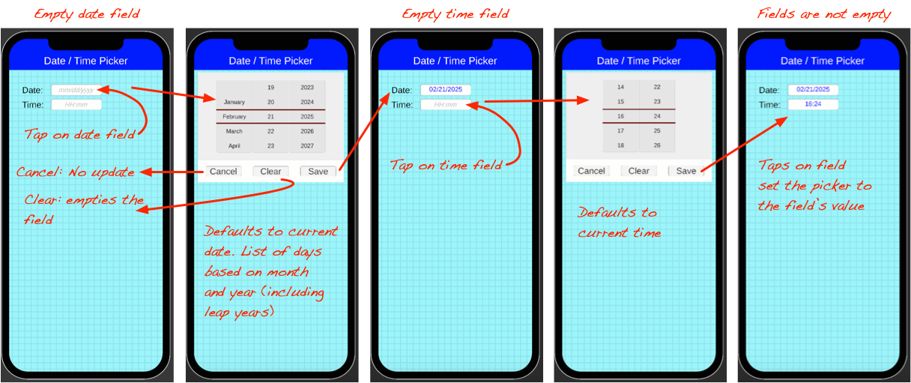

[![MIT License][license-shield]][license-url]
[![LinkedIn][linkedin-shield]][linkedin-url]
[![Twitter][Twitter-shield]][Twitter-url]
[![Facebook][Facebook-shield]][Facebook-url]
[![OBA][OBA-shield]][OBA-url]
[![Paypal][Paypal-shield]][Paypal-url]

# DateTimePicker
Unity C# implementation of a date and time picker scrollview

# What It Is:

I didn't expect to build a utility to handle activating a scrolling date and time picker. However, having looked around (admittedly not in a lot of depth) and not finding anything that fit my needs I ended up creating my own.

As part of the redevelopment of my ADK46erNow app I needed to be able to tap on a date or time field and have a window or panel appear allowing me to scroll through months, days, years or hours and minutes. And I had to develop it in C# since I'm converting this app from Solar2D using Lua to Unity using C#.

## Features

<ul>
<li>A parent panel with a date scrolling panel and a time scrolling panel.</li>
<li>The parent panel is hidden off scene by default.</li>
<li>A test date field and a test time field.</li>
<li>Tapping the date or time field animates the appearance of the parent panel and enables the respective scroller.</li>
<li>The date scrollview allows scrolling through days, months and years. The time scrollview supports hour and minute scrolling.</li>
<li>The picker panel is dismissed using the "Cancel" button (no change to the data in the date or time field, "Clear" button (empties the value out of the calling field), or "Save" button (updates the calling field with the new date or time).</li>
<li>If the date or time field is already populated, then tapping the field will pre-populate the picker.</li>
<li>If the date or time field is blank then the pickers default to the current date and time.</li>
<li>The day scrollview will adjust its days based on the selected month and year (and takes into account leap years).</li>
</ul>

## About The Code

It's free! Download it, use it, modify it!
I developed this as standalone code you can incorporate into your own projects. It's not "pretty", nor is it meant to be. That's up to you. I will be tailoring this code for the new ADK46erNow app and it will be gorgeous!
A PDF document diagramming the code architecture is available inside the "docs" directory and may help to visualize where everything lives and how the various objects communicate with each other.

## Installation

* Download this repo. The two directories that are important are the "Assets" and the "UnityPackage".
  
__New Project:__
* Create 2D Universal project
* Import "DateTimePicker.unitypackage" (in the "UnityPackage" directory)
* Delete "Sample Scene"
* Select "DateTimePicker" scene
* Select "SceneTitle" under "SceneTitleBar"
* If asked, "Import TMP Essentials"
* You may need to quit the Unity project and relaunch it to see the text in the scene.
  
__Existing Project:__
* After downloading take the individual assets and add them to your project (scripts, images, scene, prefabs) manually or by importing "DateTimePicker.unitypackage" (in the "UnityPackage" directory).
* Run the "DateTimePicker" scene!
* Update the code as needed for your projects.

<!-- BUILT WITH -->
## Built With

<ul>
  <li>Visual Studio Code version 1.97.2</li>
  <li>Unity Editor version 6 (6000.0.24f1)</li>
</ul>

<!-- SUPPORT -->
## Your Support Appreciated!

The code and documentation are all free, however, if you find this useful and are feeling generous donations via Paypal are appreciated.
If you have questions, find broken features, have requests for additional features, or have constructive feedback, let me know! 
Cheers! ~Keith

<!-- CONTACT -->
## Contact

<b>Keith Kubarek</b>

Email: <a href="mailto:ant@onebadant.com">Keith</a> 
Github Project: <a href="https://github.com/Antkmk/DateTimePicker">repository</a> 
Bluesky: <a href="https://bsky.app/profile/antkmk.bsky.social">antkmk</a> 
One Bad Ant: <a href="https://onebadant.com">web site</a> 
One Bad Ant: <a href="https://www.facebook.com/Onebadant/">Facebook page</a> 
Keith Kubarek: <a href="https://www.linkedin.com/in/keithkubarek/">Linkedin page</a>

<!-- MARKDOWN LINKS & IMAGES -->
<!-- https://www.markdownguide.org/basic-syntax/#reference-style-links -->
[issues-shield]: https://img.shields.io/github/issues/othneildrew/Best-README-Template.svg?style=for-the-badge
[issues-url]: https://github.com/othneildrew/Best-README-Template/issues
[license-shield]: https://img.shields.io/github/license/othneildrew/Best-README-Template.svg?style=for-the-badge
[license-url]: https://github.com/othneildrew/Best-README-Template/blob/master/LICENSE.txt
[linkedin-shield]: https://img.shields.io/badge/-LinkedIn-black.svg?style=for-the-badge&logo=linkedin&colorB=555
[linkedin-url]: https://www.linkedin.com/in/keithkubarek/
[Twitter-shield]: https://img.shields.io/badge/-Twitter-black.svg?style=for-the-badge&logo=Twitter&colorB=555
[Twitter-url]: https://twitter.com/antkmk
[Facebook-shield]: https://img.shields.io/badge/-Facebook-black.svg?style=for-the-badge&logo=Facebook&colorB=555
[Facebook-url]: https://www.facebook.com/Onebadant/
[product-screenshot]: images/screenshot.png

[OBA-shield]: https://img.shields.io/badge/website-555555?style=for-the-badge&logo=About.me&logoColor=white
[OBA-url]: https://onebadant.com/

[Paypal-shield]: https://img.shields.io/badge/PayPal-555555?style=for-the-badge&logo=paypal&logoColor=white
[Paypal-url]: https://www.paypal.com/donate/?hosted_button_id=JC9LWKY2YK252
